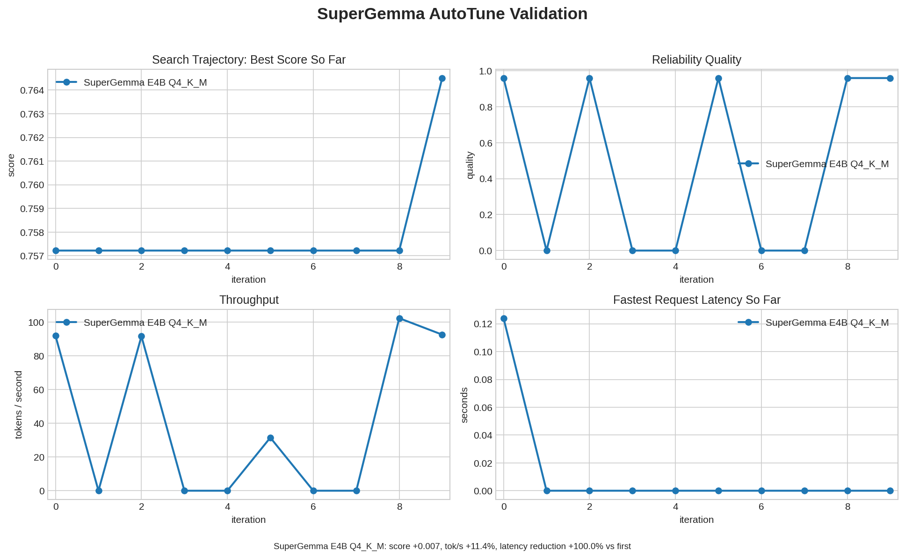
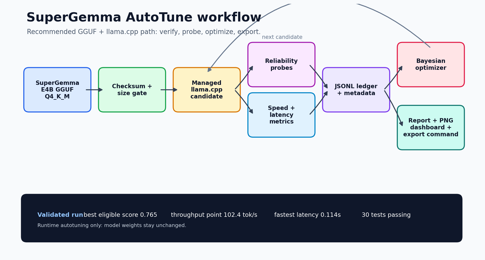
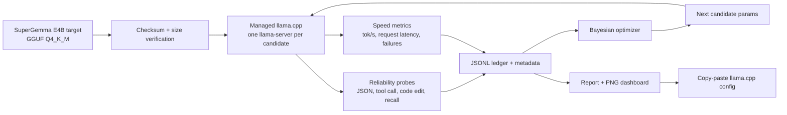

# SuperGemma AutoTune

[](https://github.com/streetquant/supergemma-autotune/actions/workflows/ci.yml)

**Production-oriented runtime autotuning for SuperGemma on local hardware.**

SuperGemma AutoTune searches runner settings for the machine in front of you. It
starts a local runner, evaluates real reliability probes, measures latency and
throughput, and emits a copy-paste configuration backed by a reproducible JSONL
ledger. It is **runtime autotuning, not weight fine-tuning**: model weights stay
unchanged.

## Why this exists

Local LLM performance is usually bottlenecked by runner details: context size,
batch/ubatch, KV cache type, GPU layer placement, sampling parameters, and the
chat/reasoning template. Copying settings from someone else's machine can look
fast but fail JSON, tool-call, or coding workflows. AutoTune makes the tradeoff
visible and repeatable for your own hardware.

| Area | What AutoTune does |
| --- | --- |
| Recommended path | SuperGemma GGUF through `llama.cpp` / `llama-server` |
| Search strategy | Bayesian optimization over safe candidate runtime settings |
| Quality gates | JSON, tool-call-shaped output, code edit, long-context recall, stability |
| Speed metrics | tokens/sec, fastest request latency, startup/runtime failures |
| Outputs | JSONL ledger, metadata sidecar, Markdown report, PNG dashboard, export command |

## Screenshots and workflow

### Optimization dashboard



Validation snapshot from **2026-05-25** on an RTX 3090 using the recommended
SuperGemma E4B `Q4_K_M` GGUF target:

| Metric | Default baseline | Best / observed during search |
| --- | ---: | ---: |
| Eligible score | `0.757` | `0.765` |
| Throughput | `91.9 tok/s` | `102.4 tok/s` |
| Fastest request latency | `0.124s` | `0.114s` |

Full commands, checksum evidence, ledger paths, and the exported best command are
in [`docs/VALIDATION.md`](docs/VALIDATION.md).

### End-to-end workflow





## Quick start

Install dependencies with `uv`:

```bash
uv sync
```

Run the deterministic mock optimizer first. This is quick, safe, and exercises
the report/plot pipeline without downloading a model.

```bash
uv run sg-autotune run --runner mock --budget 30s --out runs/mock.jsonl
uv run sg-autotune report runs/mock.jsonl --out runs/mock-report.md
uv run sg-autotune plot runs/mock.jsonl --out runs/mock-optimization.png
```

Run against the SuperGemma model-card `llama.cpp` target:

```bash
uv run sg-autotune supergemma download-command
# Copy and run the printed `hf download ...` command, then verify the GGUF.
uv run sg-autotune supergemma verify-model

uv run sg-autotune run \
  --runner llamacpp \
  --hf-model Abiray/supergemma4-e4b-abliterated-GGUF:Q4_K_M \
  --budget 30m \
  --profile coding-agent
```

Or use an already-downloaded GGUF:

```bash
uv run sg-autotune run \
  --runner llamacpp \
  --model-path ./models/supergemma4-e4b-abliterated-GGUF/supergemma4-Q4_K_M.gguf \
  --budget 2h \
  --profile coding-agent
```

Generate a report and dashboard:

```bash
uv run sg-autotune report runs/latest.jsonl --out runs/latest.md
uv run sg-autotune plot runs/latest.jsonl --out runs/latest.png
```

Start the local web UI:

```bash
uv run sg-autotune web --host 127.0.0.1 --port 7860
```

## Runners

### `llamacpp` — recommended for SuperGemma runtime tuning

Use this when you want AutoTune to apply server/runtime flags such as context,
batching, KV cache, flash attention, GPU layers, and MTP. AutoTune can either
launch from a local GGUF path or pass the model-card reference directly to
`llama-server -hf`.

### `openai` — sampling-only compatible endpoints

Use this for an already-running OpenAI-compatible endpoint when you only want
request-level sampling tuning.

```bash
uv run sg-autotune run \
  --runner openai \
  --base-url http://127.0.0.1:8080/v1 \
  --model supergemma \
  --budget 30m \
  --profile coding-agent
```

OpenAI-compatible mode intentionally does **not** pretend it can tune llama.cpp
server flags. For full SuperGemma runtime tuning, use `--runner llamacpp`.

## What it tunes

| Category | Parameters |
| --- | --- |
| Context and batching | `ctx_size`, `batch_size`, `ubatch_size`, `parallel` |
| Memory/runtime | `kv_cache`, `gpu_layers`, `flash_attn`, `mtp_enabled`, `mtp_draft_n` |
| Sampling | `temperature`, `top_p`, `top_k`, `min_p` |

## What it scores

The optimizer balances reliability and speed:

```text
score = quality
      + speed_weight * normalized_tokens_per_second
      - latency_weight * normalized_request_latency
      - memory_weight * memory_pressure
      - failure_penalty
```

Reliability probes check:

- strict JSON output
- tool-call-shaped output
- a small code-edit task
- long-context recall
- repeated-call stability
- runner crashes/timeouts

## Production guardrails

- SuperGemma-first helper commands and model catalog
- GGUF size and SHA-256 verification before benchmark runs
- managed `llama-server` lifecycle per candidate
- automatic `--reasoning off` for llama.cpp benchmark candidates
- hardware-aware safety prefilter for obvious OOM-prone candidates
- runner capability filtering so each backend only searches parameters it applies
- resumable JSONL studies with atomic metadata sidecars
- fsynced ledger writes for safer long-running optimization sessions
- Markdown reports and PNG dashboards for reviewable evidence

## Exporting the best result

```bash
uv run sg-autotune export runs/latest.jsonl --target llamacpp --model-path ./model.gguf
uv run sg-autotune export runs/latest.jsonl --target lmstudio
uv run sg-autotune export runs/latest.jsonl --target codex
```

Runtime exports such as `llamacpp` and `lmstudio` are meant for ledgers produced
by `--runner llamacpp`. OpenAI-compatible sampling-only ledgers intentionally do
not export llama.cpp server flags. A legacy Ollama Modelfile exporter exists for
users who explicitly need that format, but the validated SuperGemma path is
GGUF + `llama.cpp`.

## Validation

The current validation pass uses the SuperGemma E4B `Q4_K_M` GGUF target with
`llama.cpp`, not a generic Ollama proxy. See [`docs/VALIDATION.md`](docs/VALIDATION.md)
for reproducible commands, checksum details, hardware notes, and raw artifact
paths.

Local checks:

```bash
uv run pytest -q
```

Current status: `30 passed`.

## Roadmap

- richer model-specific memory estimation
- additional runner capability probes
- expanded benchmark profiles for chat, coding, and tool-heavy workflows
- optional side-by-side quant comparison dashboards
